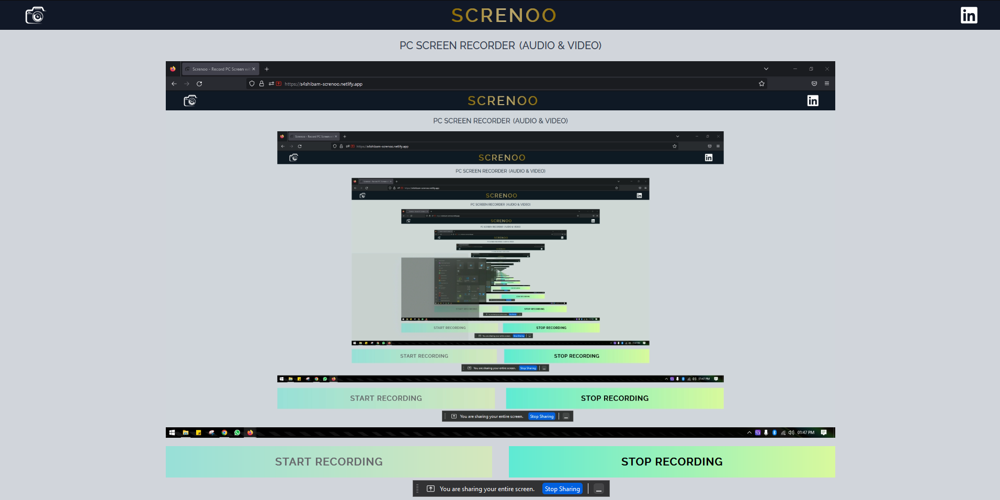
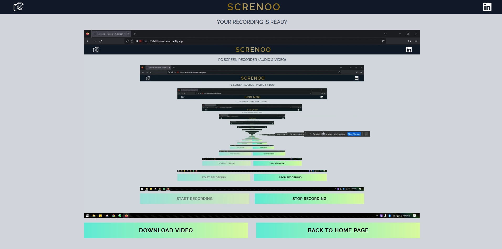

## Screnoo - PC Screen Recorder

**Details**

- This is a web application to Record PC screens along with System / User audio.
- An option is also integrated to download the recorded video in MP4 format.
- Website is secured with Javascript Interaction to protect accidental data loss (Video Recording).

**Tech Stack**

**Live Link**

- [Screnoo - Record PC Screen with Audio](https://s4shibam-screnoo.netlify.app/)

**Reference Images / Screenshots**

 
- Landing Page

 
- While Recording is On

 
- After Recording (Download Section)

 

**Follow Me**

