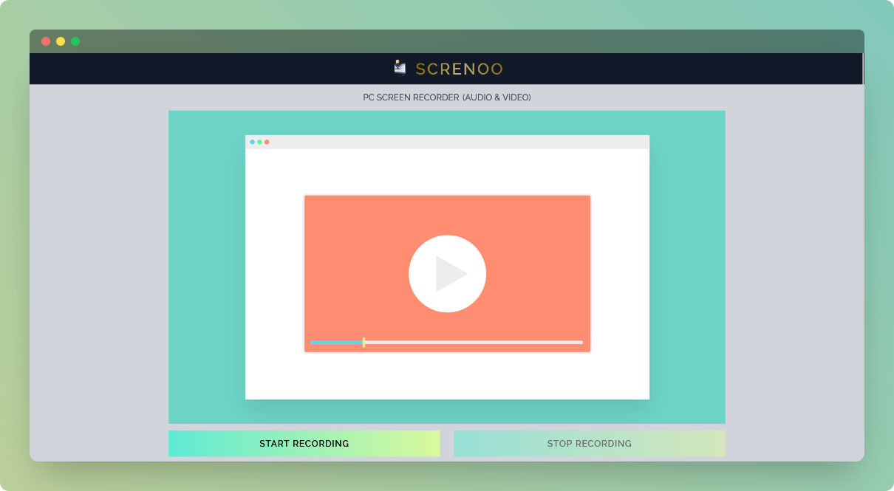
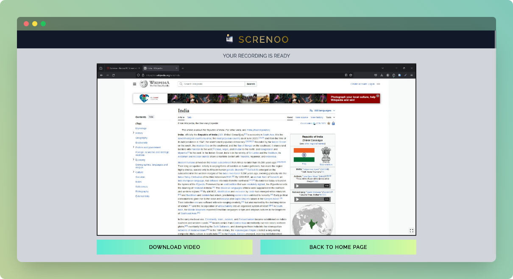

    

    <h1>Screnoo</h1>
    
PC Screen Recorder

    
    

 

## ⚡ Introduction

Screnoo is a PC Screen recorder which helps to record desktop or laptop screen along with system or user audio.

## ✨ Features
  
-  Record PC / Laptop screen
-  Record system or user audio
-  Download recording in `.mp4` format

## ⚙️ Tech Stack
  
- HTML
- Tailwind CSS
- JavaScript
- Vite JS

## 🎯 Goals

- [x] To build an application related to multimedia
- [x] To gain knowledge regarding JavaScript `mediaDevices` property
- [x] To implement a functionality using JavaScript `MediaStream` Web API

## 🖼️ Screenshots

## 👋🏻 Contact

